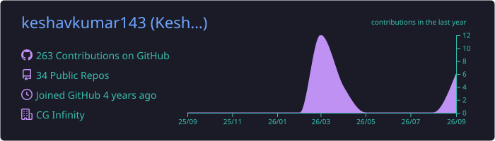
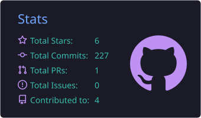
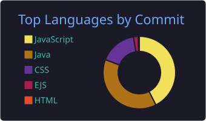
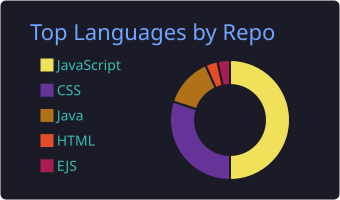
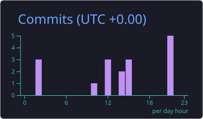

# Keshav Kumar

**Full Stack Developer · React · Node.js · MongoDB**

Building scalable, production-ready web applications.

 

 

## About

I'm a full stack developer working across the JavaScript ecosystem, from React interfaces to Node.js/Express services backed by MongoDB and MySQL. I care about writing applications that hold up in real use: clean APIs, sensible data models, and code other engineers can maintain.

<table>
  <tr>
    <td width="50%" valign="top">
      <b>Currently</b> 
      Software Developer at <i>[Company]</i>
    </td>
    <td width="50%" valign="top">
      <b>Focus</b> 
      System design and scalable application architecture
    </td>
  </tr>
</table>

 

## Tech Stack

<table>
  <tr>
    <td width="140"><b>Frontend</b></td>
    <td></td>
  </tr>
  <tr>
    <td><b>Backend</b></td>
    <td></td>
  </tr>
  <tr>
    <td><b>Databases</b></td>
    <td></td>
  </tr>
  <tr>
    <td><b>Languages</b></td>
    <td></td>
  </tr>
  <tr>
    <td><b>Cloud & Tools</b></td>
    <td></td>
  </tr>
</table>

 

## Featured Projects

| Project | Description | Stack |
| --- | --- | --- |
| [Project Name](https://github.com/keshavkumar143/REPO) | One line on what it does and what's technically interesting about it | React · Node.js · MongoDB |
| [Project Name](https://github.com/keshavkumar143/REPO) | One line on what it does and what's technically interesting about it | Tech · Tech |

 

## GitHub Activity

  

  
  

  
  

 

  

 

## Get in Touch

I'm open to conversations about full stack roles, collaborations, and interesting engineering problems. The fastest way to reach me is by [email](mailto:keshavkumar21167@gmail.com) or on [LinkedIn](https://linkedin.com/in/keshavkumar001).

